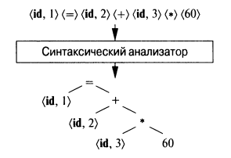

# Синтаксический анализатор
Необходимо дополнить функционал консольной утилиты, синтаксическим анализом, результатом работы которого является
синтаксическое дерево.

**Во-первых,** после формирования последовательности токенов, утилита должна проверить
синтаксис выражения, и сообщить об ошибке в случае их обнаружения.

**Например:**
* Синтаксическая ошибка! У операции <*> на позиции 4 отсутствует операнд
* Синтаксическая ошибка! У открывающей скобки <(> на позиции 15 отсутствует
* закрывающая скобка.
* Синтаксическая ошибка! После идентификатора <id,2> на позиции 26 отсуствует операция.

**Во-вторых**, после проверки синтаксиса, в случае если ошибок не обнаружено, утилита
должна построить синтаксическое дерево заданного выражения вида:

Все токены скобок приоритета операций при этом отбрасываются, тем самым приоритет
операций задаётся порядком обхода дерева.

**В-третьих,** утилита должна после формирования синтаксического дерева,
визуализировать его в текстовый файл syntax_tree.txt с помощью ascii символов любым
способом.

<=> 
|---<id,1> 
|---<+> 
>|---<id,2> 
>|---<*> 
>>|---<id,3> 
>>|---<60>

**Важно:** утилита при вызове теперь должна дополнительно принимать первый параметр –
режим работы: LEX или lex в случае запуска только лексического анализа, тогда
генерируются файлы tokens.txt и symbols.txt как результат работы, SYN или syn в случае
применения и лексического и синтаксического анализа, тогда генерируется только файл
syntax_tree.txt как результат работы. Ошибки в консоль выводятся для всех фаз анализа,
при возникновении ошибки работа утилиты прекращается.